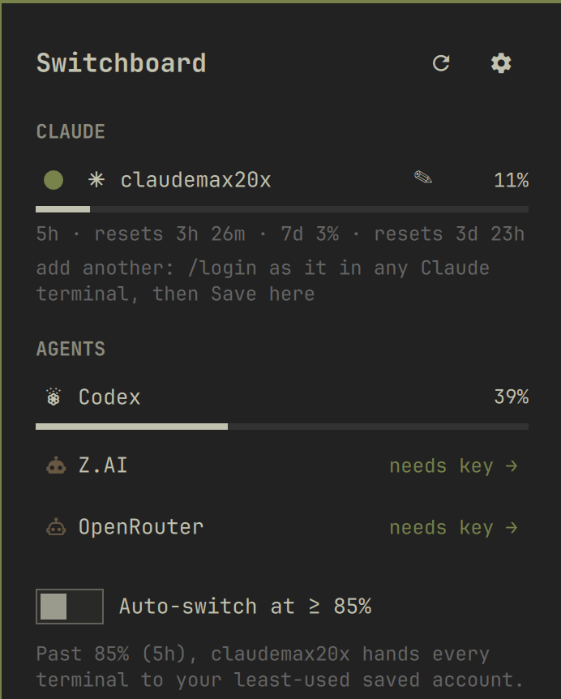

# Switchboard

Switchboard is a compact Omarchy shell plugin for the `ai-usagebar` fork. Its
native bar item and glanceable dashboard show Claude accounts, other configured
agents, relative resets, and safe account controls. The plugin shares no QML
with AI Usage Bar.



## Requirements

Switchboard is a frontend for the `ai-usagebar` **fork** that adds flat Claude
account management (save, switch, rename, marker-trusted resync) and the
report fields this plugin renders. Install the fork binary first:

```bash
cargo install --locked --git https://github.com/leonaffi-byte/ai-usagebar \
  --rev 41321cc7c29bc574fcc94e92d48fec74a475998c
```

The backend is pinned to an immutable revision (tag `v1.9.1-whkey.2`); see
[Backend provenance and audit guide](#backend-provenance-and-audit-guide).

The fork also auto-enables Kimi and SuperGrok when their CLI logins exist (set
`enabled = false` in `~/.config/ai-usagebar/config.toml` to opt out), and
providers that merely lack an API key are hidden from the dashboard until a key
is added on the settings page.

With the unmodified upstream `ai-usagebar` the plugin still shows usage, but
account rows are display-only (no save, switch, or rename) and the unsaved-login
helper never appears.

## Install

```bash
omarchy plugin add https://github.com/leonaffi-byte/switchboard --enable
```

## Remove

```bash
omarchy plugin remove leoom.switchboard
```

Removal deletes the plugin folder and its bar entry. Switchboard stores no data
of its own: usage caches and credentials belong to the `ai-usagebar` backend
(`~/.cache/ai-usagebar`, `~/.claude`, `~/.config/ai-usagebar/config.toml`).

Switchboard resolves the backend in this order: `AIUSAGEBAR_BIN`,
`$HOME/.local/bin/ai-usagebar`, then `ai-usagebar` on `PATH`. The environment
override is useful when testing a local fork build.

The bar widget defaults to a five-minute refresh, a single Claude
glyph-and-percent segment, auto-switch off, an 85% threshold, and usage alerts
off. Its `barShows` setting has three modes: `claude` shows Claude only, `all`
shows up to four agent families with percentages, and `icon` shows up to four
glyphs only. Existing `iconpct` and `full` values migrate to `all`. Left-click
opens the dashboard; middle-click requests an immediate refresh. Scrolling has
no action. The tooltip retains status for up to six families in every mode.

## Screenshots

Version 2.0 replaces the former oversized pill and panel with the shell's
native bar button and compact panel controls. Screenshots should be captured
with the active Omarchy theme because all spacing, typography, surfaces, and
colors come directly from that theme.

## Dashboard

The dashboard is one screen with these sections:

- `CLAUDE`: one compact line and meter per account. Only the active row adds a
  caption with its 5-hour and 7-day windows and relative reset times. An
  unmanaged default login gets a validated inline Save field. Rows backed by a
  saved account offer an inline rename (pencil, validated, Esc cancels), and a
  one-line hint explains how to add a second account until two exist.
- `AGENTS`: one line and meter per other agent. Metric details move to row
  tooltips; key failures become a compact `needs key →` link into settings.
- `AUTO-SWITCH`: a persistent toggle, a live explanation naming the active
  account, and the most recent switch or failure when one exists. The threshold
  is edited in settings.
- A one-line status strip for active work, a missing backend, or the newest
  action error.

The gear button swaps the dashboard for a settings page. It provides native
controls for bar mode, 60–3600 second refresh cadence in 30-second steps, usage
alerts, auto-switch, and its 50–95% threshold. The Provider Keys section uses
the backend's write-only settings bridge: existing values are never loaded into
the shell, blank fields mean unchanged, and only the explicit clear button
removes an inline key. Environment-only keys identify their environment and
cannot be cleared here. Claude, Codex, Cursor, and Kiro continue to authenticate
through their own CLIs.

## Auto-switch semantics

Auto-switch is evaluated once after each successfully parsed report. It
only acts when the active Claude account has a ready, non-cached 5-hour value at
or above the configured threshold. An unsaved default login prevents automatic
switching.

Eligible destinations must be saved, explicitly switchable accounts with ready,
non-cached data and a 5-hour value at least 10 points below the threshold. The
lowest-usage account wins; equal values are ordered by account label. Every
successful manual or automatic switch starts one shared 10-minute cooldown.
An automatic refusal also starts the cooldown so a backend safety guard is not
hammered. Switchboard never passes `--force`.

Automatic success triggers one desktop notification and a report refresh. The
last automatic success or failure remains in the card for the shell session;
turning auto-switch off only changes the displayed state to `off`.

## Threshold alerts

The optional `alerts` setting watches each ready entry's primary window. It
sends one desktop notification when that window reaches 75% and one when it
reaches 90%. Each level stays quiet while usage remains above its threshold and
re-arms only after that same entry and window drops below the level, such as
after a reset. Alert state lasts for the current shell session and is independent
of auto-switch.

## IPC and keybinding

The service exposes:

```bash
omarchy-shell leoom.switchboard toggle
omarchy-shell leoom.switchboard refresh
omarchy-shell leoom.switchboard toggleAccount
omarchy-shell leoom.switchboard status
omarchy-shell leoom.switchboard settings
```

`toggleAccount` runs the backend's guarded manual account toggle regardless of
the auto-switch setting. For a Hyprland shortcut, add:

```ini
bind = CTRL ALT SHIFT, S, exec, omarchy-shell leoom.switchboard toggleAccount
```

Busy `refresh` and `toggleAccount` IPC calls return `busy`; panel toggling and
the last-known compact status line remain available.

## Backend provenance and audit guide

Switchboard's install instructions pin the backend to one immutable commit so
that what a reviewer audits is what users execute.

- **Pinned revision:** `41321cc7c29bc574fcc94e92d48fec74a475998c`
  (annotated tag `v1.9.1-whkey.2` on https://github.com/leonaffi-byte/ai-usagebar).
- **Reproducible build:** that revision commits `Cargo.lock`; `--locked` makes
  `cargo install` refuse any dependency drift, so the build is fully determined
  by the revision.
- **Update policy:** the pin only changes through a new Switchboard commit that
  updates the SHA above; the plugin never fetches, updates, or executes any
  other source.
- **Verify what you built:** `cargo install --list` shows the installed
  revision; `git -C <clone> rev-parse HEAD` against the tag confirms it.

All file references below are at the pinned revision.

### Credential-file safety (`src/anthropic/flat_accounts.rs`)

Saved accounts live in `~/.claude/accounts/<label>.credentials.json` with an
`active.txt` marker; the live login is `~/.claude/.credentials.json`.

- Every mutation runs under an exclusive `flock` on `.switch.lock` (line 22)
  and validates the target before touching anything (`preflight_target`,
  line 509; labels must match `[a-z0-9_-]{1,32}` and pass the config validator).
- `switch_under_lock` (line 250) is journaled: it writes `.switch.journal`
  (lines 21, 48 — hashes only, never tokens), re-saves the outgoing login into
  its slot, installs the target, updates the marker, then removes the journal.
- Every write is atomic (temp file + rename) with mode `0600`
  (`atomic_write_private`, line 745); directories are created `0700`
  (`create_private_dir`, line 734).
- Guards refuse to overwrite an unmanaged live login or a slot whose credential
  lineage does not match (`--force` is never passed by the plugin).

### Locking and rollback

- `recover_under_lock` (line 383) resolves an interrupted switch on the next
  mutation: live matches the target → finish; live still matches the outgoing
  slot → discard the journal; anything else → refuse and tell the user.
- `account switch --dry-run` (`validate_switch`, line 453) runs the same
  checks read-only.
- Marker-trusted resync (line 360) rewrites only the marker's own slot from the
  live file, under the same lock, and only when the live credential matches no
  other saved account.

### Stdin-only secrets (`src/tui/settings.rs`)

- `settings apply` reads its JSON patch exclusively from stdin (lines 783–799)
  and prints `{"ok":true}`; keys never appear in argv, logs, or `settings show`.
- The config file is rewritten atomically and set to `0600` (lines 498–499).
- On the plugin side, `Service.qml` writes the patch to the process's stdin on
  start and immediately clears it from QML memory; key fields are
  `password: true` and blank means unchanged.

### Bounded process behavior

Switchboard spawns exactly two programs: `ai-usagebar` (subcommands
`usage --json`, `account save|switch|toggle|rename`, `settings show|apply`) and
`notify-send`. Every invocation goes through one fixed, positional bash wrapper
(`backendCommand` in `Model.js`; the binary and arguments travel as `"$@"` and are
never spliced into the script). The wrapper `exec`s into coreutils
`timeout --kill-after=5`, which runs the command in its own process group: on the
deadline it signals the whole group and escalates to SIGKILL, and when the shell
destroys the component (`Component.onDestruction` stops every process) the
SIGTERM lands on `timeout` itself, so no grandchild outlives the plugin. stdout
and stderr are capped at the producer boundary (`head -c`, reading one byte past
the cap so overflow is provable by UTF-8 byte length). Deadlines and caps: usage
90 s / 1 MiB, account operations 30 s / 64 KiB, settings show 15 s / 256 KiB,
settings apply 20 s / 64 KiB, binary probe 5 s, notifications 10 s; stderr is
always capped at 64 KiB. A process counts as complete only after it has exited
*and* both capped streams have ended; a deadline exit (124/137) or an overflow
is reported as a failure and never parsed. Account labels are validated before
they reach argv. CLIProxyAPI token files, when that optional source is enabled,
are opened read-only with `O_NOFOLLOW` (`src/cliproxy/mod.rs`, lines 278–283)
and are never refreshed or written. These behaviors are pinned by tests that
execute the real wrapper.

### Bounded process behavior

Every backend, executable-probe, and notification process runs through one
fixed positional-argument wrapper. Total deadlines are 90 seconds for usage,
30 seconds for account operations, 15/20 seconds for settings show/apply, 5
seconds for probes, and 10 seconds for notifications. Producer-side stdout
caps are respectively 1 MiB, 64 KiB, 256/64 KiB, 4 KiB, and 4 KiB; stderr is
always capped at 64 KiB. `timeout` owns the child process group, escalates to
SIGKILL after five seconds, and the service stops every process and drops all
queued work when destroyed. Output is parsed only after a complete,
non-truncated result. Command data remains argv-only, and account labels are
validated before reaching it. CLIProxyAPI token files, when that optional
source is enabled, are opened read-only with `O_NOFOLLOW` (`src/cliproxy/mod.rs`,
lines 278–283) and are never refreshed or written.

## License

MIT — see [LICENSE](LICENSE). The plugin bundles no third-party assets; glyphs
come from the system's Nerd Font and all styling from the active Omarchy theme.
